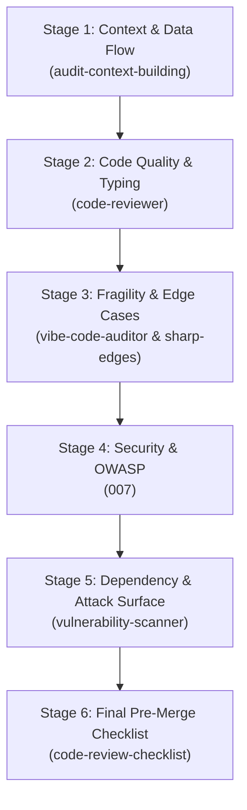

# Internal Skills Review & Recommendation Catalog

This document catalogues all installed internal skills related to bug finding, security review, static analysis, code quality checking, and vulnerability detection, tailored specifically for the `brand-visibility-agent` repository (Python codebase with Stage 3 MCP server + demo agent development).

---

## 1. Complete Catalog of Security & Code Quality Skills

### 1. `007`
- **Description:** Performs comprehensive security audits, threat modeling (STRIDE/PASTA), OWASP compliance checks, code reviews, and infrastructure hardening.
- **Relevance to Repository:** Critical for assessing the security architecture of the Stage 3 Model Context Protocol (MCP) server, API integrations, and exposed tools.
- **How to Use It:** Audits code against OWASP Top 10 vulnerabilities, uncovers unvalidated tool parameters, and evaluates authentication/authorization controls.

### 2. `vulnerability-scanner`
- **Description:** Applies advanced vulnerability analysis principles, including OWASP 2025 standards, supply chain security, attack surface mapping, and risk prioritization.
- **Relevance to Repository:** Evaluates third-party Python package dependencies (e.g., FastMCP, HTTP clients, SDKs) and maps the attack surface of exposed MCP endpoints.
- **How to Use It:** Identifies known dependency vulnerabilities, insecure communication channels, and unauthenticated endpoints in the MCP transport layer.

### 3. `security-auditor`
- **Description:** Specializes in DevSecOps auditing, enterprise cybersecurity patterns, secret management, and compliance frameworks.
- **Relevance to Repository:** Ensures environment configuration (`.env`), API keys, and credential stores used by the agent and MCP server comply with security best practices.
- **How to Use It:** Scans code for hardcoded credentials, weak permission masks on local state files, and vulnerable third-party API integration patterns.

### 4. `vibe-code-auditor`
- **Description:** Audits rapidly generated or AI-produced code for structural flaws, fragility, unhandled edge cases, and production risks.
- **Relevance to Repository:** Ideal for inspecting newly generated Python code for the demo agent and MCP tools before committing or merging.
- **How to Use It:** Uncovers silent failure modes, missing exception handlers, dynamic type assumptions, and brittle execution paths in newly added agent logic.

### 5. `audit-context-building`
- **Description:** Conducts granular, line-by-line code analysis to construct deep architectural context before initiating vulnerability searches.
- **Relevance to Repository:** Maps the internal state machine, tool invocation handlers, and response processing pipelines of the agent and MCP server.
- **How to Use It:** Traces data pathways line-by-line to detect subtle logic errors, missing input sanitization, or unexpected state mutations across agent turns.

### 6. `code-reviewer`
- **Description:** Conducts elite code reviews targeting modern code quality standards, maintainability, type safety, and clean code principles.
- **Relevance to Repository:** Enforces clean Python practices, proper `typing` annotations, PEP 8 compliance, and structured module organization across the repository.
- **How to Use It:** Flags code smells, anti-patterns, missing type hints, improper async/await usage, and unhandled exception branches in Python functions.

### 7. `code-review-checklist`
- **Description:** Provides a structured checklist covering functionality, security, performance, maintainability, and test completeness.
- **Relevance to Repository:** Acts as a quality gate before finalizing Stage 3 implementation and merging code into the main repository.
- **How to Use It:** Verifies missing test coverage, resource leaks (e.g., unclosed HTTP sessions or open file descriptors), and documentation gaps.

### 8. `bug-hunter`
- **Description:** Systematically locates and resolves bugs using root-cause tracing, symptom analysis, and regression prevention.
- **Relevance to Repository:** Helps diagnose unexpected behavior or crashes during inter-process communication between the demo agent and the MCP server.
- **How to Use It:** Isolates breaking input payloads, analyzes runtime failure modes, and guides precise code fixes without introducing regressions.

### 9. `systematic-debugging`
- **Description:** Enforces a disciplined, empirical debugging process (hypothesis testing, log analysis, verified root cause analysis) before editing code.
- **Relevance to Repository:** Prevents superficial or trial-and-error edits when resolving complex async Python or MCP protocol errors.
- **How to Use It:** Evaluates actual runtime logs and stack traces to pinpoint broken contracts between the agent orchestrator and MCP server tools.

### 10. `error-detective`
- **Description:** Searches logs and codebases for error patterns, stack traces, and anomalies, correlating errors across systems.
- **Relevance to Repository:** Helps parse runtime error logs from the demo agent and MCP server during multi-turn interactions.
- **How to Use It:** Correlates log entries across background agent execution steps to uncover the root cause of unexpected failure cascades.

### 11. `debugger`
- **Description:** Debugging specialist focused on diagnosing test failures, runtime errors, and unhandled exceptions.
- **Relevance to Repository:** Diagnoses failing `pytest` suites and async runtime exceptions in Python dependencies.
- **How to Use It:** Traces exception chains to uncover null references, key errors, and type mismatches in script logic.

### 12. `fix-review`
- **Description:** Verifies that bug fixes or vulnerability remediations accurately address audit findings without introducing new bugs.
- **Relevance to Repository:** Ensures security or bug fixes applied to the MCP server don't regress agent functionality.
- **How to Use It:** Validates patch diffs against original audit reports to verify complete remediation.

### 13. `codex-review`
- **Description:** Performs automated code reviews and generates structured changelogs for tracking modifications.
- **Relevance to Repository:** Tracks code quality changes and structural updates across Stage 3 development phases.
- **How to Use It:** Scans pull requests or file diffs to document code quality improvements and potential breaking changes.

### 14. `testing-qa`
- **Description:** Oversees comprehensive testing and QA workflows covering unit testing, integration testing, and automated test suites.
- **Relevance to Repository:** Ensures the MCP server endpoints and demo agent scenarios are covered by robust test suites.
- **How to Use It:** Identifies untested edge cases, missing test assertions, and integration gaps in the Python testing setup.

### 15. `unit-testing-test-generate`
- **Description:** Generates maintainable unit tests with strong coverage and a focus on edge cases and failure modes.
- **Relevance to Repository:** Helps generate comprehensive `pytest` test cases for MCP tools and brand visibility analysis modules.
- **How to Use It:** Discovers unhandled input combinations and creates unit tests that expose boundary-condition bugs.

### 16. `comprehensive-review-full-review`
- **Description:** Executes a multi-pass, thorough code review spanning architecture, performance, security, and maintainability.
- **Relevance to Repository:** Useful for conducting a final end-to-end review of the full `brand-visibility-agent` repository prior to Stage 3 sign-off.
- **How to Use It:** Uncovers architectural bottlenecks, cross-module coupling issues, and hidden security risks across the entire project.

### 17. `debugging-toolkit-smart-debug`
- **Description:** Provides automated diagnostic toolsets for smart error analysis and bug isolation.
- **Relevance to Repository:** Speeds up root-cause analysis when the demo agent produces unexpected tool outputs.
- **How to Use It:** Automates log scanning and state inspection to locate broken code paths during debugging sessions.

### 18. `error-diagnostics-smart-debug`
- **Description:** Analyzes complex error stack traces and pinpoints faulty source code locations.
- **Relevance to Repository:** Assists in resolving async event loop crashes or transport errors in FastMCP server instances.
- **How to Use It:** Parses raw Python tracebacks and maps them directly to the line of code responsible for runtime crashes.

### 19. `error-debugging-multi-agent-review`
- **Description:** Leverages multi-agent perspectives to analyze difficult bugs or complex failure modes.
- **Relevance to Repository:** Helpful when debugging inter-process communication issues between the demo agent host and the MCP server.
- **How to Use It:** Combines different diagnostic viewpoints to resolve intermittent or concurrency-related bugs.

### 20. `requesting-code-review`
- **Description:** Prepares code for review, verifying work against requirement specifications before merging.
- **Relevance to Repository:** Ensures Stage 3 deliverables meet all specified functional and quality requirements.
- **How to Use It:** Evaluates proposed code changes against user specifications to catch incomplete implementations.

### 21. `sharp-edges`
- **Description:** Detects fragile patterns, footguns, and edge-case pitfalls in code syntax and framework usage.
- **Relevance to Repository:** Identifies known Python pitfalls (e.g., mutable default arguments, unclosed coroutines, global state mutation).
- **How to Use It:** Scans code for subtle language-level bugs that pass basic linter checks but fail under specific execution conditions.

### 22. `performance-optimizer`
- **Description:** Identifies and fixes performance bottlenecks in code, database queries, and API calls.
- **Relevance to Repository:** Ensures MCP tool responses and brand data queries execute within acceptable latency limits.
- **How to Use It:** Detects synchronous I/O blocking inside async functions and inefficient memory usage in data processing loops.

### 23. `performance-profiling`
- **Description:** Applies profiling principles and metrics measurement to analyze runtime performance.
- **Relevance to Repository:** Profiles memory usage and response latency for the demo agent's multi-step workflows.
- **How to Use It:** Pinpoints slow execution paths, redundant API calls, and high memory allocations in Python modules.

### 24. `red-team-tactics`
- **Description:** Applies MITRE ATT&CK principles to model adversary tactics, evasion, and potential attack vectors.
- **Relevance to Repository:** Useful for threat modeling exposed MCP server endpoints that handle external web inputs or brand metrics.
- **How to Use It:** Evaluates how malicious payloads passed to agent tools could attempt command injection or SSRF attacks.

### 25. `ffuf-claude-skill`
- **Description:** Provides web fuzzing methodology using `ffuf` to discover hidden endpoints, parameters, and vulnerabilities.
- **Relevance to Repository:** Applicable if the Stage 3 MCP server or demo agent exposes HTTP/REST or SSE web interfaces.
- **How to Use It:** Reviews endpoint structures to ensure robust handling of unexpected URL parameters or fuzzing inputs.

### 26. `mobile-security-coder`
- **Description:** Enforces secure coding practices for mobile platforms, focusing on input validation, WebView security, and data storage.
- **Relevance to Repository:** Lower relevance to a backend Python agent, but provides input validation and client storage guidance if a mobile client connects to the MCP server.
- **How to Use It:** Audits input validation routines for data arriving from frontend or mobile clients.

### 27. `yes-md`
- **Description:** Enforces 6-layer AI governance, safety gates, evidence-based debugging, and machine-enforced compliance rules.
- **Relevance to Repository:** Ensures AI-driven code edits and bug fixes strictly follow evidence-based verification before being accepted.
- **How to Use It:** Prevents superficial symptom patching by requiring empirical test/log proof before confirming bug fixes.

---

## 2. Recommended Skills for a Professional Top-Developer Review Workflow

To achieve a rigorous, production-grade review pipeline for `brand-visibility-agent` (Stage 3 MCP Server & Demo Agent), the following multi-stage review workflow is recommended:

| Rank | Stage | Recommended Skill | Primary Objective & Justification |
| :--- | :--- | :--- | :--- |
| **1** | **Architectural Context** | `audit-context-building` | Builds a complete line-by-line understanding of data flow, state management, and MCP tool schemas before auditing. |
| **2** | **Code Quality & Python Standards** | `code-reviewer` | Evaluates Python type safety, PEP 8 compliance, async/await correctness, and anti-pattern avoidance. |
| **3** | **Fragility & Edge Case Detection** | `sharp-edges` & `vibe-code-auditor` | Specifically targets AI-generated code fragility, footguns, unhandled edge cases, and silent failure paths. |
| **4** | **Security & OWASP Hardening** | `007` | Conducts threat modeling and OWASP checks on exposed MCP server endpoints, tools, and API key handling. |
| **5** | **Dependency & Surface Auditing** | `vulnerability-scanner` | Audits third-party Python dependencies (FastMCP, HTTP clients) and transport interfaces for supply chain risks. |
| **6** | **Pre-Merge Acceptance Check** | `code-review-checklist` | Runs a systematic final audit against test coverage, error logging, resource cleanup, and specification compliance. |

